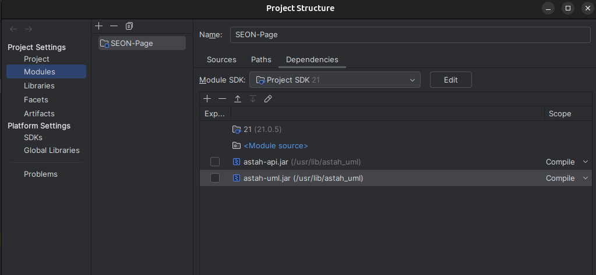

# SEON-Page-Generator

SEON-Page-Generator is a project developed to generate the SEON (Software Engineer Ontology Network) web page. Check out the latest version of the page at: [SEON Web Page](https://dev.nemo.inf.ufes.br/seon/)

## Requirements

* Java 21
* Astah UML
* Operating system: Linux
* IDE: IntelliJ IDEA

## Project Configuration

Follow these steps to set up the project in IntelliJ IDEA:

1. Open the project in IntelliJ IDEA.

2. Add the required .jar files:

    * In IntelliJ, go to:
      **File -> Project Structure -> Modules -> + -> Jars or Directories.**

    * Locate the Astah UML installation folder. Usually, it is located at: **/usr/lib/astah_uml**  
      If you can't find it, use the following terminal command:

      ```
      find / -name "astah_uml" 2>/dev/null
      ```

    * Add the following files from the Astah UML directory:       
      * **astah-api.jar**  
      * **astah-uml.jar**

    It should stay like this:
    

3. Customize the parser settings:
    * Open the `parser.properties` file located in the project directory.

    * Key configuration options include:

      * **Seon File:** Specify the `.asta` file to be processed.
      * **Astah installation directory:** Ensure the correct directory is specified.

    Ensure you save the file after making changes.

   
4. Place the `.asta` file in the main directory of the project.

## How to Run

1. In IntelliJ IDEA, navigate to the file:
   `src/main/java/seon2html/parser/SeonParser.java`

2. Run the file directly from IntelliJ.

---

## Troubleshooting

If you encounter issues while running the program, you may need to modify the `astah-command.sh` file, usually located in `/usr/lib/astah_uml/`.

Make the following changes:

1. Change:
   ```bash
   ASTAH_HOME=`pwd`
   ```
   to
   ```bash
   ASTAH_HOME=/usr/lib/astah_uml
   ```
2. Update the command:
   ```bash
   java $JAVA_OPTS -cp "$ASTAH_HOME/astah-uml.jar" com.change_vision.jude.cmdline.JudeCommandRunner "$@"
   ```
   to
   ```bash
   java $JAVA_OPTS -cp "$ASTAH_HOME/lib/*:$ASTAH_HOME/astah-uml.jar" com.change_vision.jude.cmdline.JudeCommandRunner "$@"
   ```
